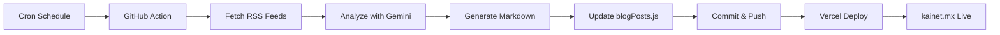

# 🤖 Automatización de Blog Posts - KAINET

## 📋 Descripción

Sistema automatizado que genera posts semanales del blog usando GitHub Actions:

- **IA Semanal**: Viernes a las 10:00 AM UTC (5:00 AM México)
- **Automatización Semanal**: Lunes a las 10:00 AM UTC (5:00 AM México)

## ⚙️ Configuración Inicial

### 1. Configurar Secret de GitHub

El workflow necesita acceso a la API de Gemini. Configura el secret:

1. Ve a tu repositorio en GitHub
2. Settings → Secrets and variables → Actions
3. Click en "New repository secret"
4. Nombre: `GEMINI_API_KEY`
5. Valor: Tu API key de Google Gemini
6. Click "Add secret"

### 2. Verificar Permisos del Workflow

Asegúrate de que GitHub Actions tenga permisos de escritura:

1. Settings → Actions → General
2. En "Workflow permissions", selecciona:
   - ✅ "Read and write permissions"
   - ✅ "Allow GitHub Actions to create and approve pull requests"
3. Save

## 🚀 Uso

### Generación Automática (Semanal)

Los posts se generan automáticamente según el schedule:

- **Viernes 10:00 UTC**: Post de IA Semanal
- **Lunes 10:00 UTC**: Post de Automatización

El workflow:
1. Ejecuta el script generador
2. Actualiza `src/data/blogPosts.js`
3. Hace commit y push automático
4. Vercel despliega automáticamente a producción

### Generación Manual

Puedes generar posts manualmente desde GitHub:

1. Ve a Actions → "Generate Weekly Blog Posts"
2. Click en "Run workflow"
3. Selecciona el tipo de post:
   - `ia` - Solo post de IA
   - `automatizacion` - Solo post de Automatización
   - `ambos` - Ambos posts
4. Click "Run workflow"

### Generación Local (Desarrollo)

```bash
# Entrar al directorio
cd mcp-server/news-aggregator

# Instalar dependencias (primera vez)
npm install

# Generar post de IA
npm run generate-post

# Generar post de Automatización
npm run generate-automation

# Ambos (usando script personalizado)
npm run generate-all
```

## 📁 Estructura de Archivos

```
kainet-final/
├── .github/
│   └── workflows/
│       └── generate-weekly-posts.yml    # GitHub Action
├── mcp-server/
│   └── news-aggregator/
│       ├── generate-post.js             # Generador IA
│       ├── generate-automation-post.js   # Generador Automatización
│       ├── package.json                  # Scripts npm
│       └── .env                          # API keys (local)
└── src/
    └── data/
        └── blogPosts.js                  # Posts publicados
```

## 🔧 Solución de Problemas

### El workflow falla con error de API

**Causa**: API key no configurada o inválida

**Solución**:
1. Verifica que el secret `GEMINI_API_KEY` exista en GitHub
2. Verifica que la API key sea válida en [Google AI Studio](https://aistudio.google.com/apikey)
3. Re-run el workflow

### El workflow no hace commit

**Causa**: Permisos insuficientes

**Solución**:
1. Settings → Actions → General
2. Habilitar "Read and write permissions"
3. Re-run el workflow

### No se generan artículos

**Causa**: Pocas noticias relevantes en las fuentes

**Solución**:
1. Revisar logs del workflow
2. Ajustar keywords en los generadores
3. Aumentar `dedupeWindowDays` en CONFIG

### El deployment a Vercel no se activa

**Causa**: El push no llegó al repositorio

**Solución**:
1. Verifica en GitHub que el commit se hizo
2. Vercel debería detectar automáticamente el push
3. Revisa los logs en el dashboard de Vercel

## 📊 Monitoreo

### Ver Ejecuciones

1. Ve a la pestaña "Actions" en GitHub
2. Selecciona "Generate Weekly Blog Posts"
3. Revisa los runs recientes

### Logs Útiles

- **Success**: ✅ Post generado, commit realizado
- **No changes**: Post generado pero igual al existente
- **Failure**: Error en API o generación (revisar logs)

### Métricas Esperadas

| Métrica | Valor Esperado |
|---------|----------------|
| Duración workflow | 5-10 minutos |
| Artículos analizados | 10-15 por post |
| Palabras generadas | 3,500-5,000 |
| Tiempo de deploy Vercel | 2-3 minutos |

## 🔄 Flujo Completo



## 📅 Calendario de Publicación

| Día | Hora (UTC) | Hora (México) | Categoría |
|-----|------------|---------------|-----------|
| Lunes | 10:00 | 05:00 | Automatización |
| Viernes | 10:00 | 05:00 | IA |

## 🎯 Próximos Pasos

- [ ] Configurar notificaciones de Slack/Discord cuando se publique
- [ ] Agregar post a LinkedIn automáticamente
- [ ] Dashboard de métricas de engagement
- [ ] A/B testing de títulos con Gemini

## 🤝 Mantenimiento

### Actualizar Fuentes RSS

Editar `CONFIG.sources` en los generadores:

```javascript
// generate-post.js o generate-automation-post.js
const CONFIG = {
  sources: {
    nuevaFuente: { 
      url: 'https://example.com/feed.xml', 
      name: 'Mi Fuente', 
      priority: 'high' 
    },
  }
}
```

### Ajustar Prompts de Gemini

Modificar la función `analyzeWithGemini()` en cada generador para cambiar el tono, enfoque o estructura del análisis.

### Cambiar Horarios

Editar `.github/workflows/generate-weekly-posts.yml`:

```yaml
schedule:
  # Nuevo horario (ejemplo: Miércoles 14:00 UTC)
  - cron: '0 14 * * 3'
```

---

**Creado por**: KAINET AI Team  
**Última actualización**: Octubre 2025  
**Versión**: 1.0.0
